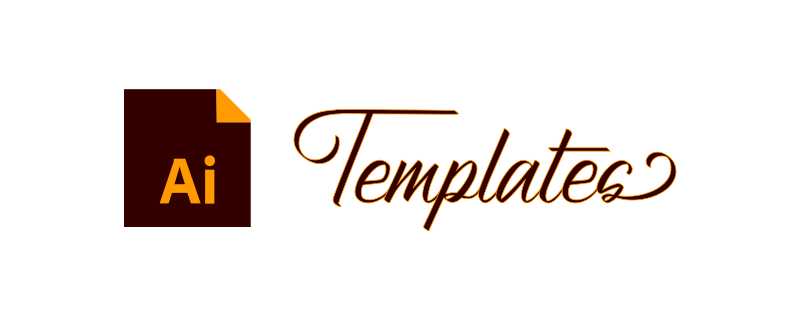

<!-- Banner -->

  
  <picture>
    
  </picture>  

 

<!-- Badges - 1st row -->

  <!-- Commit style badge -->
    
  <!-- License badge -->
      
  <!-- License badge -->
      

---

<h3 align="center">
  Practical Illustrator asset templates.
</h3>

  Various useful <b>Adobe Illustrator templates</b> for  
  <b><i>logos, icons, banners,</i></b> and <b><i>general vector assets</i></b>.

---

## ✔️ General Specs

- **Adobe Illustrator 2020** compatibility
- Practical, visually helpful **padded guides**
- **Public Domain / No Copyright / No Rights Reserved** license [*(CC0-1.0 Universal)*](https://creativecommons.org/publicdomain/zero/1.0)

## 💡 Idea / Origin

Over the years, ***I have often had to create various Adobe Illustrator 
templates***, from simple personal projects to large-scale cross-team 
collaborations. As I frequently ***found myself creating the same or very 
similar templates repeatedly***, I eventually formulated basic, practical 
asset templates, thus led me to open source and publish 
***these basic boilerplate templates*** for creating vector assets.

## 📁 Templates

<table>
  <thead>
    <tr>
      <th>File</th>
      <th>Details</th>
      <th>Download</th>
    </tr>
  </thead>
  <tbody>
    <!-- general -->
    <tr>
      <td>
        <a href="https://github.com/richrdkng/adobe-illustrator-templates/blob/main/src/general.ai">./src/general.ai</a>
      </td>
      <td>         
        <ul>
          <li>for <b>general vector assets</b> <i>(icons, logos, etc.)</i></li>
          <li><b>512x512</b> effective padded size <i>(704x704 overall artboard size)</i></li>
          <li>
            <a href="https://raw.githubusercontent.com/richrdkng/adobe-illustrator-templates/main/media/general-screenshot.jpg">Screenshot of general.ai</a>        
          </li>          
        </ul>        
      </td>
      <td>
                
      </td>
    </tr>    
    <!-- gh-banner -->
    <tr>
      <td>
        <a href="https://github.com/richrdkng/adobe-illustrator-templates/blob/main/src/gh-banner.ai">./src/gh-banner.ai</a>
      </td>
      <td>         
        <ul>
          <li>for GitHub <b>main banner in markdowns</b></li>
          <li><b>552x172</b> effective padded size <i>(800x320 overall artboard size)</i></li>          
          <li>
            <a href="https://raw.githubusercontent.com/richrdkng/adobe-illustrator-templates/main/media/gh-banner-screenshot.jpg">Screenshot of gh-banner.ai</a>
          </li>          
        </ul>
      </td>
      <td>
                
      </td>
    </tr>
  </tbody>
</table>

## ©️ License

**Public Domain / No Copyright / No Attribution / No Rights Reserved**

*You can copy, modify, distribute and perform the work, 
even for commercial purposes, all without asking permission.*

[CC0-1.0 Universal *(No Copyright)*][url-license]

<!--- References =============================================================================== -->

<!--- URLs -->
[url-website]: https://www.richrdkng.com
[url-license]: https://github.com/richrdkng/adobe-illustrator-templates/blob/main/LICENSE
