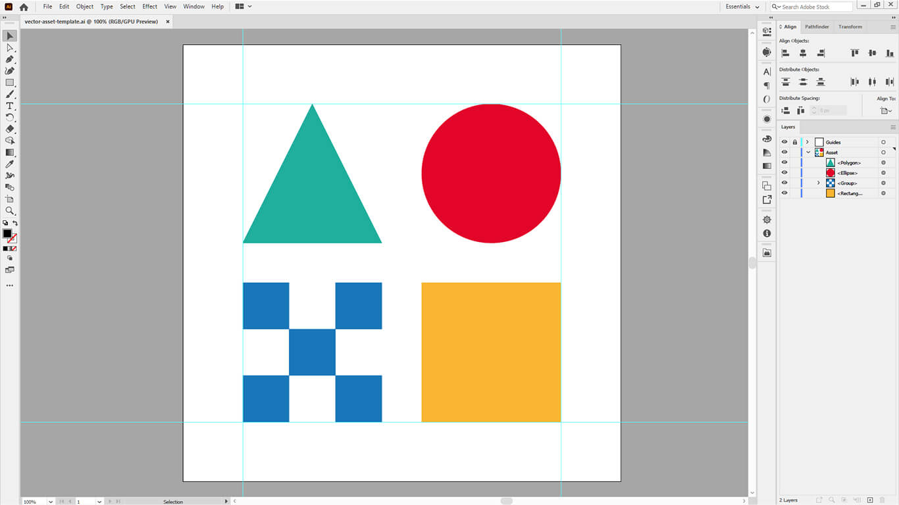

<!-- Banner -->

  
  <picture>
    
  </picture>  

 

<!-- Badges - 1st row -->

  <!-- Commit style badge -->
    

<!-- Badges - 2nd row -->

  <!-- License badge -->
      
  <!-- License badge -->
      

---

<h3 align="center">
  Practical AI asset templates.
</h3>

  Various useful <b>Adobe Illustrator templates</b> for  
  <b><i>logos, icons, banners,</i></b> and <b><i>vector assets</i></b>.

---

  

---

    

## 🎨 Specs

- Effective asset size of **512x512** *(704x704)*
- **Adobe Illustrator 2020** compatibility *(still one of the most popular versions)*
- With 4 visually helpful **padded guides**
- **No Copyright** license [*(CC0 1.0 UNIVERSAL)*](https://creativecommons.org/publicdomain/zero/1.0)

## 💡 Idea

Over the years, ***I have often had to create various Adobe Illustrator 
templates***, from simple personal projects to large-scale cross-team 
collaborations. As I frequently ***found myself creating the same or very 
similar templates repeatedly***, I eventually formulated a basic, practical 
vector asset template. This led me to publish ***this basic starter template*** 
for creating vector assets.

## ©️ License

***You can copy, modify, distribute and perform the work, 
even for commercial purposes, all without asking permission.***

[CC0 1.0 *(No Copyright)*][url-license] @ [richrdkng][url-website]

<!--- References =============================================================================== -->

<!--- URLs -->
[url-website]: https://www.richrdkng.com
[url-license]: https://github.com/richrdkng/adobe-illustrator-templates/blob/main/LICENSE
