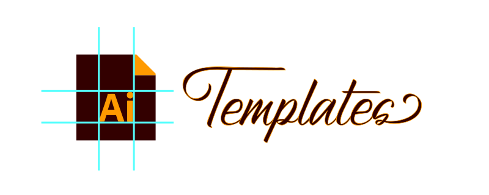

<!-- Banner -->

  
  <picture>
    
  </picture>  

 

<!-- Badges - 1st row -->

  <!-- Commit style badge -->
    
  <!-- License badge -->
      
  <!-- License badge -->
      

---

<h3 align="center">
  Useful Adobe Illustrator asset templates.
</h3>

  Various practical and handy <b>Adobe Illustrator templates</b> for  
  <b><i>logos, icons, banners,</i></b> and <b><i>general vector assets</i></b>.

---

## ✔️ General Specs

- **Adobe Illustrator 2020** compatibility
- Practical, visually helpful **padded guides**
- **Public Domain / No Copyright / No Rights Reserved** license [*(CC0-1.0 Universal)*](https://creativecommons.org/publicdomain/zero/1.0)

## 📁 Templates

Over the years, ***I have often had to create various Adobe Illustrator 
templates***, from simple personal projects to large-scale cross-team 
collaborations. As I frequently ***found myself creating the same or very 
similar templates repeatedly***, I eventually formulated basic, practical 
asset templates. This led me to open source and publish 
***these basic boilerplate templates*** for creating vector assets.

---

### 🎨 General Template

This template is **recommended for general vector assets** 
*(icons, logos, square/rectangular assets, etc.)*.

- size: **512x512** effective padded size *(704x704 overall artboard size)*
- file: [./templates/general-template.ai](https://github.com/richrdkng/adobe-illustrator-templates/blob/main/templates/general-template.ai)
- screenshot: [./media/screenshots/general-template.jpg](https://raw.githubusercontent.com/richrdkng/adobe-illustrator-templates/main/media/screenshots/general-template.jpg)

 

 

 
 
 

### 📁 GitHub-specific Templates

These templates are **recommended for creating GitHub-specific vector assets** 
*(profile pictures, assets in markdown documents, etc.)*.

---

### 🎨 GitHub Profile Picture

This template is ***recommended for creating GitHub profile pictures assets***
for personal and organization accounts.

This template has **2 guides** *(outer, and inner)*, and it is
***designed to offer 3 choices to the creator whether to fill out*** the 
profile picture frames on GitHub ***fully or partially***:

- size **512x512** - overall artboard size:
  - ***fills out the profile picture frame completely***
  - recommended for assets designed to fill/reach the entirety
    of the profile picture frame

- size ***450x450*** - using the outer guides:
  - will leave a ***tiny, barely visible padding*** in the profile picture frame
  - ***recommended in general for assets*** intended to be used as a 
    profile picture, as this will have a really small,
    yet visually pleasing, distinguishing padding around the asset

- size ***400x400*** - using the inner guides:
  - will leave a ***small, yet visible padding*** in the profile picture frame
  - recommended for assets ***in case the 450x450 outer guide doesn't suite the
    creator's intentions***, as this will result a small margin-like visible
    padding around the asset

---

- size: **512x512** overall artboard size *(with 2 guides: outer of 450x450, inner of 400x400)*
- file: [./templates/gh-profile-picture.ai](https://github.com/richrdkng/adobe-illustrator-templates/blob/main/templates/gh-profile-picture.ai)
- screenshot: [./media/screenshots/gh-profile-picture.jpg](https://raw.githubusercontent.com/richrdkng/adobe-illustrator-templates/main/media/screenshots/gh-profile-picture.jpg)

 

 

 
 
 

---

### 🎨 GitHub Markdown Banner

This template is ***recommended for creating banner assets in GitHub-flavored markdowns***.

The top banner in markdowns is typically an image *(or multiple)* ***representing
the project as a leading graphical asset***.

- size: **552x172** effective padded size *(800x320 overall artboard size)*
- file: [./templates/gh-markdown-banner.ai](https://github.com/richrdkng/adobe-illustrator-templates/blob/main/templates/gh-markdown-banner.ai)
- screenshot: [./media/screenshots/gh-markdown-banner.jpg](https://raw.githubusercontent.com/richrdkng/adobe-illustrator-templates/main/media/screenshots/gh-markdown-banner.jpg)

 

 

 
 
 

## ©️ License

**Public Domain / No Copyright / No Attribution / No Rights Reserved**

*You can copy, modify, distribute and perform the work, 
even for commercial purposes, all without asking permission.*

[CC0-1.0 Universal *(No Copyright)*][url-license]

<!--- References =============================================================================== -->

<!--- URLs -->
[url-website]: https://www.richrdkng.com
[url-license]: https://github.com/richrdkng/adobe-illustrator-templates/blob/main/LICENSE
